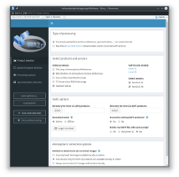
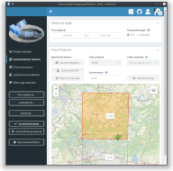
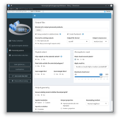
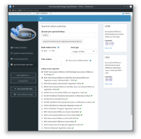

```{r setup, include=FALSE}
knitr::opts_chunk$set(echo = TRUE)
```

The simplest way to use sen2r is to execute it in interactive mode. These commands:

```{r, eval = FALSE}
library(sen2r)
sen2r()
```

will open the `sen2r()` GUI. The GUI is organized in several panels (click on the images below for larger versions), allowing to set all the required processing parameters. Help is provided to aid the user regarding the more complex parameters. 

<p style="text-align:center;">
  <a href="https://raw.githubusercontent.com/ranghetti/sen2r/devel/man/figures/sen2r_gui_sheet1.png" target="_blank">
    
  </a>
  <a href="https://raw.githubusercontent.com/ranghetti/sen2r/devel/man/figures/sen2r_gui_sheet2.png" target="_blank">
    
  </a>
  <br/>
  <a href="https://raw.githubusercontent.com/ranghetti/sen2r/devel/man/figures/sen2r_gui_sheet3.png" target="_blank">
    
  </a>
  <a href="https://raw.githubusercontent.com/ranghetti/sen2r/devel/man/figures/sen2r_gui_sheet4.png" target="_blank">
    
  </a>
  <a href="https://raw.githubusercontent.com/ranghetti/sen2r/devel/man/figures/sen2r_gui_sheet5.png" target="_blank">
    
  </a>
</p>

The left-side bar of the dashboard allows instead to : 

1. Save the current parameters to a JSON file for later use, using the __Save Options as__ button in the left bar; This allows for example to easily set-up parameters for a processing chain that can be later launched from the command line (See XZZZZZZ); 
2. Restore previously saved parameters using the __Load Options__ button) (See XXXXX); 
3. Specify the path a log file where processing messages will be saved; 
4. Launch the processing. In this case, the GUI will close and `sen2r()` execution will start. You will be able to monitor `sen2r()` progress from the processing messages sent to R/RStudio console (unless you specified to create a log file, in which case messages will be diverted to that file);
5. Exit the GUI without launching the processing. 

 

